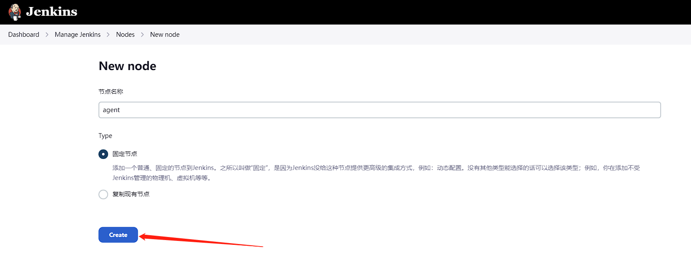

# jenkins

[jenkins](https://www.jenkins.io/zh/)  
[docker hub](https://hub.docker.com/r/jenkins/jenkins)  

## 使用docker部署jenkins

``` sh
docker run -d -v jenkins_home:/var/jenkins_home -p 8080:8080 -p 50000:50000 --restart=on-failure jenkins/jenkins
```

> -p 8080:8080 映射web页面端口  
> -p 50000:50000 映射slave节点通信端口  
> -v jenkins_home:/var/jenkins_home 映射数据卷  

## 使用docker部署jenkins slave节点

#### 1. 在jenkins中创建slave节点

打开jenkins页面，点击左侧菜单栏的“系统管理”->“管理节点”->“新建节点”，输入节点名称，选择“永久节点”，点击“确定”按钮。




#### 2. 配置slave节点

远程工作目录：/home/jenkins/agent  
启动方式：通过Java Web启动  

配置完成后点击保存按钮。


#### 3. 获取slave节点的secret

点击slave节点的名称，进入节点状态页面，找到命令中的secret。


#### 4. 使用docker部署slave节点

``` sh
docker run --rm \
--init jenkins/inbound-agent \
-tunnel :13665 \
-url http://192.168.1.36:13660/ \
-workDir=/home/jenkins/agent \
1e35239194ae3d6142635165809259aa79a416968c2a84f80adeba715b797d0b \
agent
```

ps: -tunnel 开始的参数是传递给容器的参数, 需要填写在镜像名后面(不是docker 容器启动的参数)

> -tunnel ${ip}:${port} 指定jenkins master的ip和端口, 如果需要通过代理访问主节点(或者主节点的端口不是默认端口)，则需要指定代理的ip和端口  
> -url http://192.168.1.36:13660/ 制定主节点的url  
> -workDir=/home/jenkins/agent 指定工作目录  
> 1e35239194ae3d6142635165809259aa79a416968c2a84f80adeba715b797d0b 指定secret  
> agent 指定slave节点的名称  

相关参数请自行修改

#### 5. 查看slave节点状态

如果成功启动，jenkins页面会显示节点状态为在线。


#### 6. 可以基于 jenkins/inbound-agent 镜像定制自己的从节点

``` dockerfile
FROM jenkins/inbound-agent

...
```
