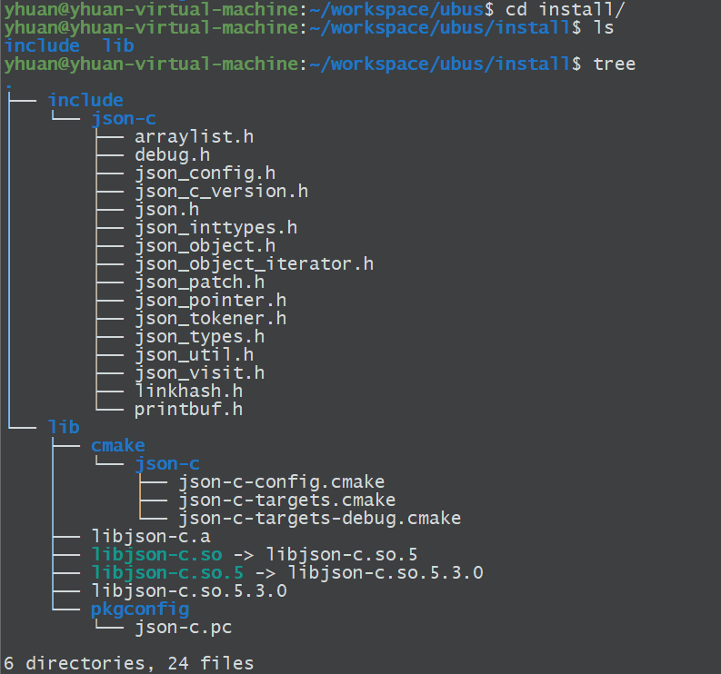
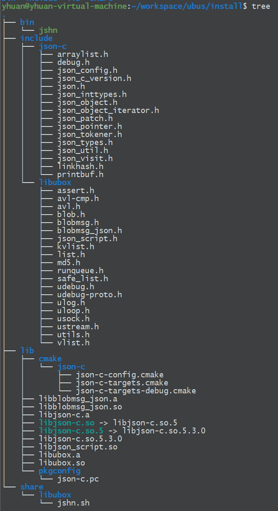
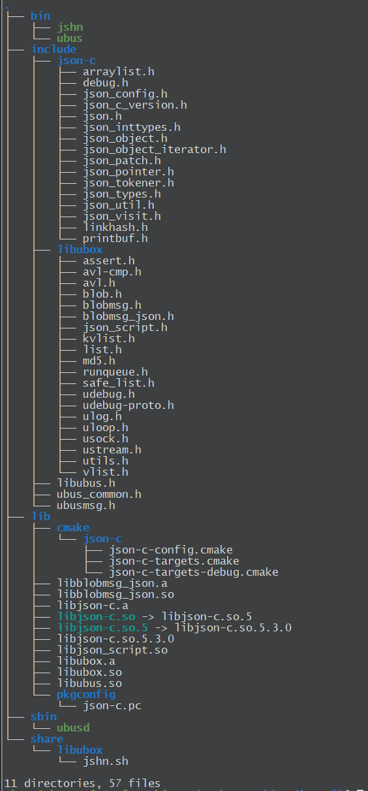

# ubus


作者：yhuan

日期：2024-06-08


本文主要介绍ubus构建以及简易使用方法


[ubus wiki](https://openwrt.org/docs/techref/ubus)


## ubus简介

ubus是用于OpenWrt的总线框架，类似Ubuntu上的d-Bus，提供进程间通信能力（IPC）。

ubus相对比较轻量，可以移植到常用的嵌入式环境中。


## 构建


ubus构建依赖3个仓


```
https://github.com/json-c/json-c.git
http://git.openwrt.org/project/libubox.git
https://git.openwrt.org/project/ubus.git
```


json-c：用于消息序列化/反序列化

libubox：ubus运行的基础库

ubus：ubus本体


需要依次构建上述3个仓库。


### 仓库代码下载

```shell
mkdir -p ~/workspace/ubus
cd ~/workspace/ubus

# 下载仓库代码
git clone https://github.com/json-c/json-c.git
git clone http://git.openwrt.org/project/libubox.git
git clone https://git.openwrt.org/project/ubus.git
```


### 项目构建配置文件

```shell
cd ~/workspace/ubus
vim ubus.cmake

添加以下内容:

set(CMAKE_SYSTEM_NAME Linux)

# 工具链配置
# SET(TOOLCHAIN_DIR "/opt/ssc_toolchains/arm-buildroot-linux-uclibcgnueabihf-4.9.4-uclibc-1.0.31")
# set(CMAKE_C_COMPILER ${TOOLCHAIN_DIR}/bin/arm-buildroot-linux-uclibcgnueabihf-gcc)
# set(CMAKE_CXX_COMPILER ${TOOLCHAIN_DIR}/bin/arm-buildroot-linux-uclibcgnueabihf-g++)

set(CMAKE_FIND_ROOT_PATH "/home/yhuan/workspace/ubus")
set(CMAKE_FIND_ROOT_PATH_MODE_LIBRARY ONLY)
set(CMAKE_FIND_ROOT_PATH_MODE_INCLUDE ONLY)
set(CMAKE_PREFIX_PATH "/home/yhuan/workspace/ubus/install")
set(INSTALL_PATH "/home/yhuan/workspace/ubus/install")
```


### json-c构建

```shell
cd ~/workspace/ubus

# 创建build目录
mkdir -p build/json-c && cd build/json-c

# 构建
cmake -DCMAKE_INSTALL_PREFIX=/home/yhuan/workspace/ubus/install -DCMAKE_TOOLCHAIN_FILE=../../ubus.cmake ../../json-c
make
make install
```

make install完成后，相关库文件会生成在/home/yhuan/workspace/ubus/install路径下




### libubox构建

```shell
cd ~/workspace/ubus

# 创建build目录
mkdir -p build/libubox && cd build/libubox

# 构建
cmake -DBUILD_LUA=OFF -DCMAKE_INSTALL_PREFIX=/home/yhuan/workspace/ubus/install -DCMAKE_TOOLCHAIN_FILE=../../ubus.cmake ../../libubox
make
make install
```

-DBUILD_LUA=OFF：不构建lua相关代码




### ubus构建

```shell
cd ~/workspace/ubus

# 创建build目录
mkdir -p build/ubus && cd build/ubus

# 构建
cmake -DBUILD_LUA=OFF -DCMAKE_INSTALL_PREFIX=/home/yhuan/workspace/ubus/install -DCMAKE_TOOLCHAIN_FILE=../../ubus.cmake ../../ubus
make
make install
```



​	其中，ubusd是后台服务程序，所有服务启动之后需要向ubusd注册。ubus可以用于命令行调试。


## 使用


上述构建过程中，由于安装路径没有配置为系统自带的lib目录，因此，如果需要运行构建完成的这几个文件，需要先添加动态库路径

```shell
# 进入动态库路径
cd ~/workspace/ubus/install

# 引入环境变量
export LD_LIBRARY_PATH=${LD_LIBRARY_PATH}:`pwd`
```


### 守护程序ubusd启动


```shell
yhuan@yhuan-virtual-machine:~/workspace/ubus/install/sbin$ ./ubusd --help
./ubusd: invalid option -- '-'
Usage: ./ubusd [<options>]
Options: 
  -A <path>:            Set the path to ACL files
  -s <socket>:          Set the unix domain socket to listen on
```


### 启动指令

> ./ubusd -s /tmp/ubus -A /home/yhuan/workspace/ubus/config


### 参数解析

-s：ubus运行过程中，需要创建一个unix socket用于服务之间的通信。可以通过-s参数制定该文件的路径。

​	默认路径在CMakeLists.txt文件中配置

```
ubus/CMakeLists.txt:16

SET(UBUS_UNIX_SOCKET "/var/run/ubus/ubus.sock")
```


-A：指定acl目录路径，该文件夹下的文件用于配置服务访问权限。

​	默认acl路径为

> /usr/share/acl.d


## 测试程序


### server权限配置


ubus在构建时会构建两个demo程序 server 和 client，这两个程序会放在build/ubus/example目录下。

```shell
yhuan@yhuan-virtual-machine:~/workspace/ubus/build/ubus/examples$ pwd
/home/yhuan/workspace/ubus/build/ubus/examples
yhuan@yhuan-virtual-machine:~/workspace/ubus/build/ubus/examples$ ls -l
总用量 272
-rwxrwxr-x 1 yhuan yhuan 126216 6月   8 17:13 client
drwxrwxr-x 4 yhuan yhuan   4096 6月   8 17:08 CMakeFiles
-rw-rw-r-- 1 yhuan yhuan   1153 6月   8 16:23 cmake_install.cmake
-rw-rw-r-- 1 yhuan yhuan  10043 6月   8 16:23 Makefile
-rwxrwxr-x 1 yhuan yhuan 128992 6月   8 17:13 server
```


其中，server作为服务端，在启动后会注册名为test的服务，服务下有3个可调用的方法

​	hello，watch，count

为了让当前用户（yhuan）能够调用这个服务以及服务下的方法，需要先配置服务权限（acl）。


*ps:我们这里以 /home/yhuan/workspace/ubus/config 目录作为权限配置目录*


1. 在 /home/yhuan/workspace/ubus/config 目录下创建一个与服务名同名的文件 test.json

   ```shell
   vim /home/yhuan/workspace/ubus/config/test.json
   ```

   

2. 配置权限

   ```json
   {
       "user": "yhuan",
       "access": {
           "test": {
               "methods": [
                   "hello",
                   "watch",
                   "count"
               ]
           }
       },
       "send": [
           "test"
       ],
       "subscribe": [
           "test"
       ],
       "publish": [
           "test"
       ]
   }
   ```

3. 权限文件本身的权限也有要求（校验不通过会把权限文件忽略掉）

   ```shell
   sudo chown 0:0 test.json
   sudo chmod 644 test.json
   ```

   > 相关代码：

   ```c
   > ubus/ubusd_acl.c
   
   void
   ubusd_acl_load(void)
   {
   	struct stat st;
   	glob_t gl;
   	size_t j;
   	const char *suffix = "/*.json";
   	char *path = alloca(strlen(ubusd_acl_dir) + strlen(suffix) + 1);
   
   	sprintf(path, "%s%s", ubusd_acl_dir, suffix);
   	if (glob(path, GLOB_NOESCAPE | GLOB_MARK, NULL, &gl))
   		return;
   
   	vlist_update(&ubusd_acl_files);
   	for (j = 0; j < gl.gl_pathc; j++) {
   		if (stat(gl.gl_pathv[j], &st) || !S_ISREG(st.st_mode))
   			continue;
   
   		if (st.st_uid || st.st_gid) { // 限制文件属于root用户
   			syslog(LOG_ERR, "%s has wrong owner\n", gl.gl_pathv[j]);
   			continue;
   		}
   		if (st.st_mode & (S_IWOTH | S_IWGRP | S_IXOTH)) { // 限制文件权限, other 不可写, 不可执行，group不可写
   			syslog(LOG_ERR, "%s has wrong permissions\n", gl.gl_pathv[j]);
   			continue;
   		}
   		ubusd_acl_load_file(gl.gl_pathv[j]);
   	}
   
   	globfree(&gl);
   	vlist_flush(&ubusd_acl_files);
   	ubusd_acl_seq++;
   	ubusd_send_event(NULL, "ubus.acl.sequence", ubusd_create_sequence_event_msg, NULL);
   }
   ```

   

### 启动测试程序


socket路径：/tmp/ubus

acl路径：/home/yhuan/workspace/ubus/config


1. 先启动ubusd

   ```shell
   ./ubusd -s /tmp/ubus -A /home/yhuan/workspace/ubus/config
   ```

   

2. 启动server

   ```shell
   ./server -s /tmp/ubus
   ```

   

3. 启动client

   ```shell
   ./client -s /tmp/ubus
   ```

   client日志参考：

   ```shell
   yhuan@yhuan-virtual-machine:~/workspace/ubus/build/ubus/examples$ ./client -s /tmp/ubus 
   Avg time per iteration: 115 usec
   Subscribers active: 1
   Got fd from the server, watching...
   completed request, ret: 0
   Avg time per iteration: 49 usec
   Got line: msg1: test received a message: blah
   Sending count up to '100100'; string has length '592926'
   Server validated our count up to '100100'
   Got line: msg2: test received a message: blah
   Avg time per iteration: 79 usec
   Got line: msg3: test received a message: blah
   Avg time per iteration: 109 usec
   Got line: msg4: test received a message: blah
   Sending count up to '100200'; string has length '593629'
   Server validated our count up to '100200'
   Avg time per iteration: 93 usec
   Got line: msg5: test received a message: blah
   Avg time per iteration: 104 usec
   Got line: msg6: test received a message: blah
   Sending count up to '100300'; string has length '594333'
   Server validated our count up to '100300'
   Avg time per iteration: 116 usec
   Got line: msg7: test received a message: blah
   Avg time per iteration: 127 usec
   Got line: msg8: test received a message: blah
   Sending count up to '100400'; string has length '595036'
   Server validated our count up to '100400'
   Avg time per iteration: 131 usec
   Got line: msg9: test received a message: blah
   Avg time per iteration: 129 usec
   Got line: msg10: test received a message: blah
   Sending count up to '100500'; string has length '595739'
   Server validated our count up to '100500'
   Avg time per iteration: 132 usec
   Got line: msg11: test received a message: blah
   Got line: msg12: test received a message: blah
   Avg time per iteration: 131 usec
   ```

4. ubus工具测试

   server启动后也可以使用ubus工具进行测试

   ```shell
   # 展示服务列表
   yhuan@yhuan-virtual-machine:~/workspace/ubus/build/ubus$ ./ubus -s /tmp/ubus list
   test
   
   # 调用test下的hello方法
   yhuan@yhuan-virtual-machine:~/workspace/ubus/build/ubus$ ./ubus -s /tmp/ubus call test hello '{"id":0,"msg":"hello"}'
   {
           "message": "test received a message: hello"
   }
   ```

   

## 异常处理


本人在运行demo程序的时候，主要遇到的问题就是acl配置的问题。如果acl文件格式不对或者权限配置不对，会导致server程序启动后无法正常注册服务

```shell
yhuan@yhuan-virtual-machine:~/workspace/ubus/build/ubus/examples$ ./server -s /tmp/ubus 
Failed to add object: Invalid argument
```

这个问题可能是acl文件不属于root用户（chown 0:0），或者文件权限不对（chmod 644）导致加载acl文件时，ubusd工具跳过了配置文件。于是当前用户（yhuan）无法正常注册服务。

如果全程使用root账户也许就不会遇到这个问题（？）


## 参考文档


1. [Openwrt从小白到专家：ubus总线和uci](https://blog.csdn.net/whstudio123/article/details/120811616)

2. [OpenWrt开发必备软件模块——系统总线ubus](https://blog.csdn.net/qq_41453285/article/details/102595943)

3. [ubuntu编译ubus及相关依赖库](https://blog.csdn.net/a29562268/article/details/89054122)

4. [ubuntu安装UCI](https://blog.csdn.net/rainforest_c/article/details/70142987)
5. [使用ubus实现进程通信](https://www.cnblogs.com/LiuYanYGZ/p/14204757.html)

